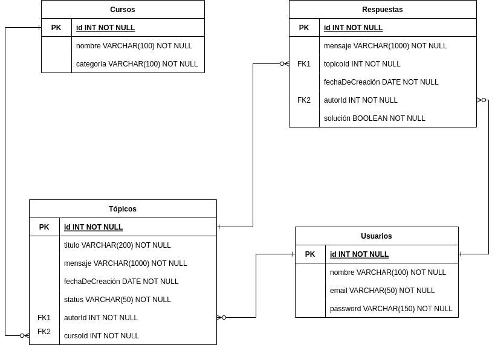

# Foro Alura 

Este proyecto funciona como back-end para una aplicación web tipo foro online de una plataforma educativa. La aplicación considera diferentes endpoints con las cuales se pueden realizar diversas acciones, tales como registrar usuarios, crear y consultar tópicos, y agregar respuestas a los mismos. 

La aplicación back-end atenderá las solicitudes en 4 diferentes controllers, uno para cada tabla de la base de datos.

## Tecnologías utilizadas:

  - [Eclipse](https://www.eclipse.org/)
  - [MySql](https://www.mysql.com/)
  - [Java](https://www.java.com/en/)

  - [Spring Security](https://start.spring.io/)
  - [Token JWT](https://jwt.io/)

## Diagrama entidad-relación de la base de datos

La base de datos consta de 4 diferentes tablas. 

La tabla usuarios almacena la información relacionada con el login del usuario y sirve como referencia de la pertenencia de una respuesta o un tópico. 

La tabla cursos solamente contiene información de los cursos existentes dentro de la plataforma a la que pertenece el foro, de los cuales se pueden abrir tópicos para solventar dudas o par ampliar la información existente. 

La tabla tópicos es el punto central de la aplicación, ya que esta contendrá la funcionalidad central del foro, al albergar los diferentes tópicos abiertos por los usuarios. Los tópicos pertenecen a un usuario, son sobre un curso de la plataforma y pueden contener respuestas a partir de las cuales puede cambiar el estado del tópico (estos estados se explicaran más adelante).

La tabla respuestas corresponde a las respuestas de los tópicos, separadas gracias a su referencia al elemento tópico correspondiente de cada respuesta.

En su conjunto, estas cuatro tablas permiten el uso de la aplicación web de forma funcional.

## Estados de un topico

Los tópicos pueden estar en 4 diferentes estados:

 - NO_RESPONDIDO
 - NO_SOLUCIONADO
 - SOLUCIONADO
 - CERRADO

El estado NO_RESPONDIDO lo tendrá cuando el tópico no tenga respuestas.
 
El estado NO_SOLUCIONADO lo tendrá un tópico cuando ya cuente con al menos una respuesta, pero que ninguna de estas sea una solución al problema.
 
El estado SOLUCIONADO lo tendrá un tópico cuando este contenga alguna respuesta que esté señalada como solución al tópico.
 
El estado CERRADO solo lo tendrá un tópico cuando después de un determinado tiempo el tópico no haya sido solucionado o a petición del autor del tópico. Esta acción para esta aplicación solo estará disponible para realizarse de forma manual a través del correspondiente endpoint de tópicos.

## Uso de la aplicación

Para hacer uso de la aplicación en su entorno de desarrollo se recomienda el uso del IDE Eclipse. La aplicación al momento de ejecutarse despliega al mismo tiempo la documentación del proyecto, la cual hace uso de una url para ser desplegada al usuario.

La documentación por su naturaleza está disponible en dos url según su uso:

* Formato Swagger UI 

http://server:port/context-path/swagger-ui.html

* Formato Json

http://server:port/context-path/v3/api-docs

La documentación por su naturaleza en su versión de interfaz de usuario permite la interacción con los endpoints de la aplicación, sin embargo, se recomienda el uso de postman u otro software similar.

Si se desea agregar un nuevo usuario a la base de datos a través de la aplicación, se necesita enviar la contraseña encriptada con el algoritmo Bcrypt de 10 pasos. Para realizar el login no se necesita enviar la contraseña encriptada, se envía la contraseña en claro y la aplicación automáticamente hará la verificación al encriptarla y verificar su hash.
